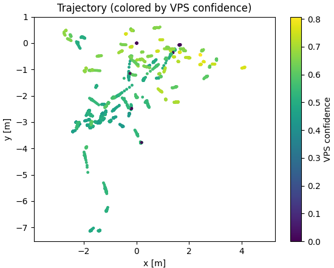
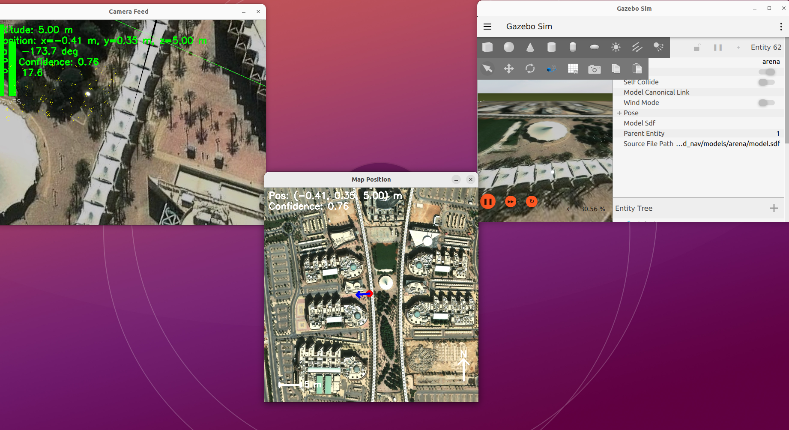

## GPS-Denied Navigation (ROS-free, ArduPilot + Gazebo)

End-to-end pipeline that fuses high-rate optical-flow VIO and low-rate global Visual Place Recognition (VPS), optimizes with a factor graph, and streams vision poses to ArduPilot via MAVLink. Designed to run without ROS, integrate with SITL + Gazebo, and expose practical knobs for performance and robustness.

### Contents
- [What this repository provides](#what-this-repository-provides)
- [Definitions (quick glossary)](#definitions-quick-glossary)
- [Architecture and dataflow](#architecture-and-dataflow)
- [Repository structure](#repository-structure)
- [Prerequisites](#prerequisites)
- [Install](#install)
- [Configuration reference (src/config.yaml)](#configuration-reference-srcconfigyaml)
- [Quick start](#quick-start)
- [Tools](#tools)
- [Results](#results)
- [Troubleshooting](#troubleshooting)
- [Performance and stability tips](#performance-and-stability-tips)
- [Map preparation & calibration](#map-preparation--calibration)
- [Development notes](#development-notes)
- [License & credits](#license--credits)

### What this repository provides
- Sensors: Gazebo H.264 UDP camera client (OpenCV GStreamer); MAVLink IMU/yaw inputs
- Local motion (VIO): ORB-seeded Lucas–Kanade optical flow with FB check, affine RANSAC + MAD gating, motion mask, ZUPT-like damping, EKF predict/correct, nonlinear yaw update
- Global fixes (VPS): SIFT pyramid + tiling, FLANN ratio test, RANSAC with degeneracy checks, confidence-weighted temporal smoothing
- Fusion: Factor graph optimizer (GTSAM if available) with robust losses, continuity prior, adaptive covariances; buffered fallback if GTSAM unavailable
- Scheduling & resilience: Adaptive rates (EMA + hysteresis), watchdogs (OF/VPS/IMU), monotonic timing, IMU interpolation
- Outputs & tooling: MAVLink VISION_POSITION_ESTIMATE (+ optional VISION_SPEED_ESTIMATE), CSV logs, optional recording, UI overlays, metrics CLI, replay utility, self-check

---

## Definitions (quick glossary)
- GPS-Denied Navigation: Estimating a UAV’s pose without GNSS by combining onboard vision and IMU and using map-based global cues.
- VIO (Visual-Inertial Odometry): Local relative motion from camera + IMU. Here: optical flow + EKF (state: position, velocity, quaternion, accel/gyro biases).
- VPS (Visual Place Recognition): Global absolute fixes from matching camera frames to a known map (SIFT + homography + checks).
- Factor Graph Optimization: Fusing relative and absolute constraints (and priors) to yield a consistent pose estimate. Uses robust losses and adaptive noise.
- Nonlinear Yaw Update: EKF update for yaw using a numerical Jacobian w.r.t. quaternion, with chi-square gating.
- Motion Mask: Suppressing dynamic/outlier regions based on OF residuals to improve VPS.
- Adaptive Rates / Watchdogs: Adjusting processing rates based on confidence and auto-recovering from stale/failing sensors.

---

## Architecture and dataflow
1) Camera (Gazebo H.264 over UDP via GStreamer) → frames
2) MAVLink (ATTITUDE/RAW_IMU/GPS) → IMU and yaw priors
3) Optical flow (ORB seeds → LK → FB check → affine RANSAC → gating) → planar motion, motion mask, confidence
4) VIO EKF (predict with IMU, correct with OF position/velocity; optional ATTITUDE yaw update)
5) VPS (SIFT pyramid/tiling + FLANN + homography checks + smoothing; optional use of motion mask)
6) Factor graph (relative from VIO, absolute from VPS, yaw priors, continuity) → fused pose
7) Outputs (MAVLink vision pose, CSV logs, UI overlays, recordings)

---

## Repository structure
```
gps_denied_nav/
├── models/                      # Gazebo models
├── worlds/                      # Gazebo world/SDF
├── src/
│   ├── config.yaml              # Central configuration
│   ├── main_loop.py             # Runtime orchestrator (entry point)
│   ├── fusion/factor_graph.py   # GTSAM fusion; buffered fallback
│   ├── sensors/gazebo_camera.py # OpenCV GStreamer UDP camera client
│   ├── vision/optical_flow.py   # OpticalFlowTracker
│   ├── vision/vio_tracker.py    # EKF (p, v, q, biases) + nonlinear yaw update
│   └── vision/vps_transformer.py# SIFT VPS (pyramid/tiling, smoothing)
│   └── tools/
│       ├── metrics_cli.py       # Analyze CSV logs; optional plots
│       ├── replay_reader.py     # Replay recorded frames
│       ├── self_check.py        # Smoke tests for OF/VIO/VPS
│       └── transforms.py        # Angle utilities
├── requirements.txt
├── setup.sh                     # Optional system deps helper
└── README.md
```

---

## Prerequisites
- OS: Ubuntu 22.04 recommended
- System OpenCV (with GStreamer support) and GStreamer packages:
```bash
sudo apt update
sudo apt install -y python3-venv python3-pip libopencv-dev \
  gstreamer1.0-tools libgstreamer1.0-dev libgstreamer-plugins-base1.0-dev \
  gstreamer1.0-plugins-bad gstreamer1.0-libav gstreamer1.0-gl
```
- ArduPilot SITL + Gazebo (external)
  - Launch SITL: `sim_vehicle.py -v ArduCopter -f gazebo-iris --console --map`
  - Launch world: `gz sim -v4 -r worlds/iris_runway_ngps.sdf`
  - Enable camera streaming (example):
```bash
gz topic -t /world/iris_runway_ngps/model/iris_with_gimbal/model/gimbal/link/pitch_link/sensor/camera/image/enable_streaming \
  -m gz.msgs.Boolean -p "data: true"
```
- Verify UDP video stream (diagnostic):
```bash
gst-launch-1.0 -v udpsrc port=5600 \
  caps="application/x-rtp,media=(string)video,clock-rate=(int)90000,encoding-name=(string)H264,payload=(int)96" \
  ! rtpjitterbuffer ! rtph264depay ! avdec_h264 ! videoconvert ! autovideosink sync=false
```

---

## Install
Option A (recommended): venv with system OpenCV available to Python
```bash
git clone https://github.com/AyedAlmudarra/GPS-Denied-Navigation.git
cd GPS-Denied-Navigation
python3 -m venv venv --system-site-packages
source venv/bin/activate
pip install --upgrade pip
pip install -r requirements.txt  # does NOT install opencv-python
```
Option B (minimal manual deps)
```bash
python3 -m venv venv && source venv/bin/activate
pip install --upgrade pip
pip install numpy pymavlink matplotlib scipy PyYAML
```
Note: Avoid `opencv-python` pip wheels; they typically lack GStreamer. Use the system `libopencv-dev` instead.

---

## Configuration reference (`src/config.yaml`)
Minimal required settings (already present):
```yaml
camera: {udp_port: 5600, fx: 525.0, fy: 525.0, cx: 320.0, cy: 240.0, distortion: [0,0,0,0,0]}
map: {pixels_per_meter: 20}
```
Key sections (high-level):
- camera
  - `udp_port`: Gazebo H.264 UDP port
  - `fx, fy, cx, cy, distortion`: intrinsics (if unknown, keep defaults)
- vision.flow
  - OF seeding, LK, RANSAC/gating, downscale, FB check, grid parameters
  - `focal_length_px`: pixel→meter scale with altitude
- vision.vio (cleaned)
  - `flow_rate_hz`: OF update cadence
  - `max_cov`: EKF covariance ceiling
  - `yaw_update_from_attitude`: fuse ATTITUDE yaw prior via nonlinear update
- vision.vps
  - `map_path`: exact map image used by Gazebo (north‑up)
  - `nfeatures, min_matches, ratio_thresh, scale_levels, tile_rows/cols, features_per_tile`
  - `focal_px`: must match camera fx/fy when using altitude/focal fallback
  - `use_motion_mask, early_score_threshold, smoothing_window`
- fusion
  - `abs_sigma, rel_sigma, continuity_sigma`: Pose3 sigmas for absolute/relative/continuity
  - `robust_loss, robust_delta, adaptive_cov, yaw_prior_sigma, yaw_sign`
- mavlink
  - `connection_str`: e.g., `tcp:127.0.0.1:5762`, `udp:0.0.0.0:14550`
  - `vision_rate_hz`
- mission
  - `takeoff_alt`: wait threshold before starting vision
- map
  - `pixels_per_meter`: used by overlays; if unknown for VPS, VPS falls back to altitude/focal
- ui
  - `headless`: disable windows for performance
- logging
  - `eval_csv_path`, `enable_truth`, `summary_interval_sec`
- runtime
  - `watchdogs`: OF/VPS/IMU timeouts; failure thresholds
  - `adaptive_rates`: enable + bounds; confidence thresholds
  - `opencv`: optimization flags
  - `recording`: to save frames/IMU/video

Calibration tips
- pixels_per_meter (ppm): measure pixels across a known distance on the same map image; `ppm = pixels / meters`
- focal_px: use your calibrated camera fx/fy (in pixels). Must be consistent with the map scale and altitude usage.
- yaw_sign: set `-1` if heading appears mirrored.

---

## Quick start
```bash
source venv/bin/activate
python3 -m src.main_loop
```
Windows and hotkeys (when not headless)
- Camera Feed: HUD + OF tracks + confidence bars
- Map Position: trail, pose arrow, confidence, scale bar, north arrow
- Hotkeys: q quit; t tracks; m motion-mask; b confidence bars; n scale/N; r reset OF; p screenshots (in `recordings/`)

Headless (recommended for performance)
- Set `ui.headless: true` in `src/config.yaml`

---

## Tools
- Self check (no Gazebo required)
```bash
python3 src/tools/self_check.py
```
- Metrics/plots (after a run with CSV enabled)
```bash
python3 src/tools/metrics_cli.py --csv navigation_eval.csv --plot
```
Reports: `vps_conf_mean`, `of_conf_mean`, mean FPS, `pos_rmse_m` (if ENU truth), `yaw_err_mean_rad` (if yaw truth)
- Replay recorded frames
```bash
python3 src/tools/replay_reader.py --dir recordings/run_01 --fps 20 --show
```

---

## Results


MetricsResult (trajectory colored by VPS confidence):

- Scatter plot of estimated trajectory with point color = VPS confidence [0,1].
- Reproduce: `python3 src/tools/metrics_cli.py --csv navigation_eval.csv --plot`.

Result1 (camera HUD + map overlay at moderate confidence):

- Left: Camera Feed with HUD (OF tracks, bars, pose text). Center: Map Position with trail, heading arrow, scale and north.
- Shows a stable match near confidence ~0.6.

Result2 (camera HUD + map overlay at higher confidence):

- Similar scene under better texture/geometry; confidence ~0.75 with clearer alignment.

---

## Troubleshooting
- OpenCV GStreamer error opening pipeline
  - Use system OpenCV (`libopencv-dev`), not `opencv-python` wheels.
  - Keep venv with `--system-site-packages` so Python can use system OpenCV.
- ModuleNotFoundError: `src`
  - Run from repo root: `python3 -m src.main_loop`.
- VPS confidence ~0.0 with spikes
  - Map mismatch (area/rotation/scale). Use the exact world’s map image (north‑up). Check `focal_px` and `pixels_per_meter`.
- IMU timeouts in logs
  - CPU bound; run headless; reduce VPS cost (scale_levels/tiling); verify MAVLink endpoint.
- SciPy/NumPy version warning
  - If needed: `pip install 'numpy<1.25'` or upgrade SciPy per your environment.
- Yaw seems flipped
  - Set `fusion.yaw_sign: -1`.

---

## Performance and stability tips
- Optical Flow
  - `vision.flow.downscale`: 0.5 is a good starting point; 1.0 for accuracy, <0.5 for speed.
  - Increase grid rows/cols and `features_per_cell` for more uniform coverage.
  - FB check (`fb_check_enabled`) + `fb_error_thresh` reduces outliers.
- VPS
  - Use tiling to improve feature uniformity; raise `nfeatures` and `features_per_tile` as needed.
  - `early_score_threshold` stops search once a strong match is found.
  - Enable `use_motion_mask` to suppress dynamic/outlier regions.
- Fusion
  - `abs_sigma` vs `rel_sigma` balance VPS vs VIO influence. Lower sigmas = stronger constraints.
  - `continuity_sigma` adds smoothness when VPS is sparse.
  - `yaw_prior_sigma` sets how strongly ATTITUDE yaw is trusted.
- Scheduling
  - Enable `adaptive_rates`; keep VIO higher than VPS for stability.

---

## Map preparation & calibration
- Use the exact image the world uses (matching resolution/orientation; north‑up).
- Derive `pixels_per_meter` from known distances on that exact image.
- Ensure `focal_px` matches your camera intrinsics.

---

## Development notes
- Code style favors clarity and explicitness. Many functions/classes include detailed docstrings.
- GTSAM is optional; if not present, the optimizer falls back to a buffer-based mode (suitable for demos).
- Logging: periodic summaries controlled by `logging.summary_interval_sec`; detailed logs in `navigation_debug.log`.


## License & credits
- Derived from community efforts on GPS-denied UAV navigation and related experimentation.
- License: MIT (unless otherwise noted for model/world assets).
